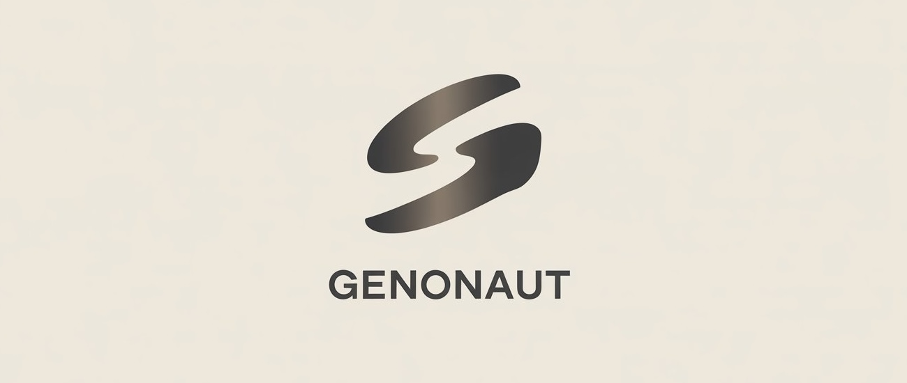

<p align="center">
  
</p>

Supercharge your Gen-AI art process. Generate huge numbers of images based on your preferences, artistic 
directions you wish to explore, and novel routes you didn't even think of. Find models and prompts that work amazingly 
when combined, and find and filter those which do not.

Core features
- **Generations**: Generate art using ComfyUI integration.
- **Models**: Easily find and download AI models for image generation.
- **Browse & Catalogue**: Browse, search, filter, rate, and tag.
- **Advanced Search**: Search with quoted phrases for exact matching, full search history with management UI. See [Search Documentation](docs/search.md).
- **Tag System**: Hierarchical tag organization with 127+ curated tags, polyhierarchy support, and gallery filtering.
- **Bookmarks & Favorites**: Save and organize your favorite images into hierarchical categories. Pin important bookmarks, add notes, control privacy, and sort by rating or date. Automatically creates an "Uncategorized" category for easy organization.
- **Recommenders**: Automatically generate works based on your preferences and use cases. Explore novel combinations /
directions.
- **Community**: Browse and auto-generate based on popular community trends, and other users like you.
- **Content Moderation**: Automatic content flagging system with risk assessment and admin management tools.

Platforms
- **Cloud**
- **Windows, MacOS, & Linux**: Local and browser-based

<!--
<p align="center">
  Early alpha development UI.
</p>

<p align="center">
  <a href="docs/screenshots/dash.png">
    
  </a>
</p>


<table>
  <tr>
    <td align="center" width="50%">
      <a href="docs/screenshots/gens.png">
        
      </a>
    </td>
    <td align="center" width="50%">
      <a href="docs/screenshots/settings.png">
        
      </a>
    </td>
  </tr>
</table>
-->

<p align="center">
  Join the <a href="https://forms.gle/2e2uC3owXLNNS4tTA">waiting list</a> to be notified for early access.
</p>

---

## Setup
### Installation
Prerequisites
  - Python 3.10+

Installation steps:
1. Create virtual environment: `virtualenv env/python_venv`, and activate it.
2. `pip install -r requirements.txt`
3. Create Postgres DB
  - Create your `.env` file (see "Environment variables" below)
  - Run: `make init` or `python -m genonaut.db.init`

### Environment and Configuration

Genonaut uses a two-tier configuration system:
- **JSON config files** (`config/`) - Non-sensitive application configuration
- **.env files** (`env/`) - Sensitive credentials and secrets

**Setup:**
1. Copy the example files:
   ```bash
   cp env/env.shared.example env/.env.shared
   cp env/env.location-type.example env/.env.local-dev
   ```
2. Edit `env/.env.shared` with your actual credentials
3. Edit `env/.env.local-dev` for development-specific settings

**Required Variables (in env/.env.shared):**
- `DB_PASSWORD_ADMIN` - Admin user password (full database privileges)
- `DB_PASSWORD_RW` - Read/write user password (data operations only)
- `DB_PASSWORD_RO` - Read-only user password (select operations only)
- `API_SECRET_KEY` - Secret key for JWT tokens and cryptographic operations

**Environment Targets:**
- `local-dev` - Local development
- `local-demo` - Local demo database
- `local-test` - Local test database
- `cloud-*`: 1 for each of the above, but for cloud-hosted environments.
- `cloud-prod` - Cloud production

For complete configuration documentation including load order, variable precedence, and adding new environments, see 
[Configuration Documentation](docs/configuration.md).

### Database Setup

After configuring environment variables, initialize the database:

```bash
make init          # main database
make init-demo     # demo database
make init-test     # test database (truncates & re-seeds with demo fixtures)
```

This creates the necessary database tables and schema. For detailed database documentation including schema details, 
JSONB usage, and troubleshooting, see [Database Documentation](docs/db.md)


## Running

### Backend: API Server

```bash
# Start API server
make api-dev                # Development database
make api-demo               # Demo database  
make api-test               # Test database
```

**Quick Access:**
- Interactive docs: `http://localhost:8001/docs`
- Health check: `http://localhost:8001/api/v1/health`

For complete API documentation, endpoint details, configuration options, and troubleshooting, see 
[API Documentation](docs/api.md).

### Frontend

The React frontend lives in `frontend/` and mirrors the API feature set with dashboard, content, recommendation, 
settings, and auth placeholder pages.

- Install deps: `cd frontend && npm install`
- Dev server: `npm run dev`
- Tests & linting: `npm run test` (all tests), `npm run test-unit` (unit only), `npm run lint`
- Make helpers: `make frontend-dev`, `make frontend-test`, `make frontend-build`

See [Frontend Overview](docs/frontend/overview.md) for architecture, commands, and testing notes.

## Cloud app administrative features
- [Flagging](docs/flagging.md): Genonaut includes an automatic content flagging system that detects potentially 
problematic content based on configurable word lists.

## Developer docs
See more: [full dev docs](docs/developer.md)

### Directory structure
- `config/` - JSON configuration sets that define environment-specific application settings.
- `docs/` - Project documentation for developers, testing practices, API usage, and database details.
- `env/` - Environment assets including example dotenv files, the local Python virtual environment, and Redis configs.
- `frontend/` - Vite-powered frontend application, tests, and related tooling.
- `genonaut/` - Core backend source code, including FastAPI services, models, and business logic.
- `infra/` - Infrastructure and deployment tooling such as Terraform, Kubernetes, or automation scripts.
- `notes/` - Working documentation to manage current, future, and prior tasks; almost all files here are markdown.
- `test/` - Additional testing resources and harnesses outside the main backend and frontend test suites.

### Testing
Genonaut uses a three-tier testing approach: unit tests (no dependencies), database tests, and API integration tests 
(requires web server running).

**Essential Commands**
```bash
# Quick testing during development
make test-unit              # Unit tests only (< 10 seconds)
make test-db                # Database tests (30-60 seconds)
make test-api               # API integration tests (2-5 minutes)
make frontend-test-unit
make frontend-test-e2e

# Comprehensive testing
make test-all               # Run all test suites

# Test database setup
make init-test              # Initialize test database
make api-test               # Start API server for testing
```

For detailed testing documentation, setup requirements, troubleshooting, and best practices, see 
[Testing Documentation](docs/testing.md).

---

<p align="center">
  Join our <a href="https://forms.gle/2e2uC3owXLNNS4tTA">waiting list</a> to be notified about early access!
</p>
