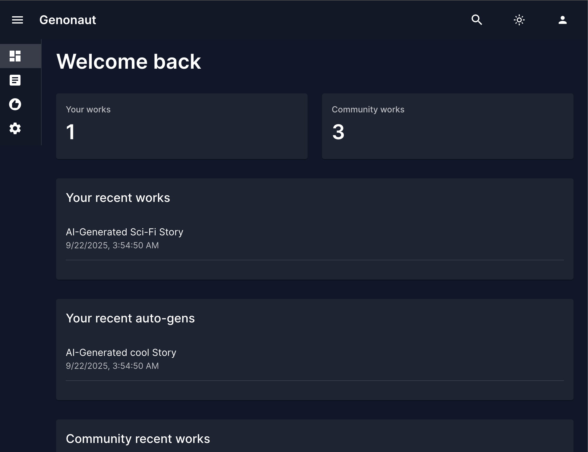

# Genonaut
Recommender systems &amp; perpetual generation for gen AI.

Core features
- **Generations**: Generate art using ComfyUI integration.
- **Models**: Easily find and download AI models for image generation.
- **Browse & Catalogue**: Browse, search, filter, rate, and tag.
- **Recommenders**: Automatically generate works based on your preferences and use cases. Explore novel combinations / directions.
- **Community**: Browse and auto-generate based on popular community trends, and other users like you.

Platforms
- **Cloud**
- **Windows, MacOS, & Linux**: Local and browser-based

---

<p align="center">
  Early alpha development UI.
</p>

<!-- Row 1: one image centered -->
<p align="center">
  <a href="docs/screenshots/dash.png">
    
  </a>
</p>

<!-- Row 2: two images side by side -->
<table>
  <tr>
    <td align="center" width="50%">
      <a href="docs/screenshots/gens.png">
        
      </a>
    </td>
    <td align="center" width="50%">
      <a href="docs/screenshots/settings.png">
        
      </a>
    </td>
  </tr>
</table>

<p align="center">
  Join the <a href="https://forms.gle/2e2uC3owXLNNS4tTA">waiting list</a> to be notified for early access.
</p>
 

## Set up
### Installation
Prerequisites
  - Python 3.10+

Installation steps:
1. Create virtual environment  
2. `pip install -r requirements.txt`
3. Create Postgres DB
  - Create your `.env` file (see "Environment variables" below)
  - Run: `make init` or `python -m genonaut.db.init`

### Environment variables
Configure database and API settings via environment variables:

**Setup:**
1. Copy the example environment file: `cp env/env.example .env`
2. Edit `.env` with your actual database credentials.

**Required Variables:**
- `DB_PASSWORD_ADMIN` - Admin user password (full database privileges)
- `DB_PASSWORD_RW` - Read/write user password (data operations only)  
- `DB_PASSWORD_RO` - Read-only user password (select operations only)

**Key Optional Variables:**
- `DATABASE_URL` - Complete PostgreSQL connection URL (recommended for production)
- `API_SECRET_KEY` - Secret key for JWT tokens and cryptographic operations
- `API_ENVIRONMENT` - Which database to use by default (`dev`/`demo`/`test`)

For complete environment variable documentation, configuration behavior, and troubleshooting, see [Database Documentation](docs/db.md).

### Database Setup

After configuring environment variables, initialize the database:

```bash
make init          # main database
make init-demo     # demo database
make init-test     # test database (truncates & re-seeds with demo fixtures)
```

This creates the necessary database tables and schema. For detailed database documentation including schema details, JSONB usage, and troubleshooting, see [Database Documentation](docs/db.md).

## Running

### API Server

Genonaut provides a complete REST API with 77 endpoints across 6 categories (Users, Content, Interactions, Recommendations, Generation Jobs, System).

```bash
# Start API server
make api-dev                # Development database
make api-demo               # Demo database  
make api-test               # Test database
```

**Quick Access:**
- Interactive docs: `http://localhost:8000/docs`
- Health check: `http://localhost:8000/api/v1/health`

For complete API documentation, endpoint details, configuration options, and troubleshooting, see [API Documentation](docs/api.md).

### Frontend

The React frontend lives in `frontend/` and mirrors the API feature set with dashboard, content, recommendation, settings, and auth placeholder pages.

- Install deps: `cd frontend && npm install`
- Dev server: `npm run dev`
- Tests & linting: `npm run test` (all tests), `npm run test-unit` (unit only), `npm run lint`
- Make helpers: `make frontend-dev`, `make frontend-test`, `make frontend-build`

See [Frontend Overview](docs/frontend/overview.md) for architecture, commands, and testing notes.

## Testing

Genonaut uses a three-tier testing approach: unit tests (no dependencies), database tests (requires DB), and API integration tests (requires web server).

### Essential Commands
```bash
# Quick testing during development
make test-unit              # Unit tests only (< 10 seconds)
make test-db                # Database tests (30-60 seconds)
make test-api               # API integration tests (2-5 minutes)

# Comprehensive testing
make test-all               # Run all test suites

# Test database setup
make init-test              # Initialize test database
make api-test               # Start API server for testing
```

For detailed testing documentation, setup requirements, troubleshooting, and best practices, see [Testing Documentation](docs/testing.md).

## Developer docs
Running tests:
`make test` or `pytest test/ -v` (`-v` optional, for verbosity) 

See more: [full dev docs](docs/developer.md)

---

<p align="center">
  Join our <a href="https://forms.gle/2e2uC3owXLNNS4tTA">waiting list</a> to be notified about early access!
</p>
