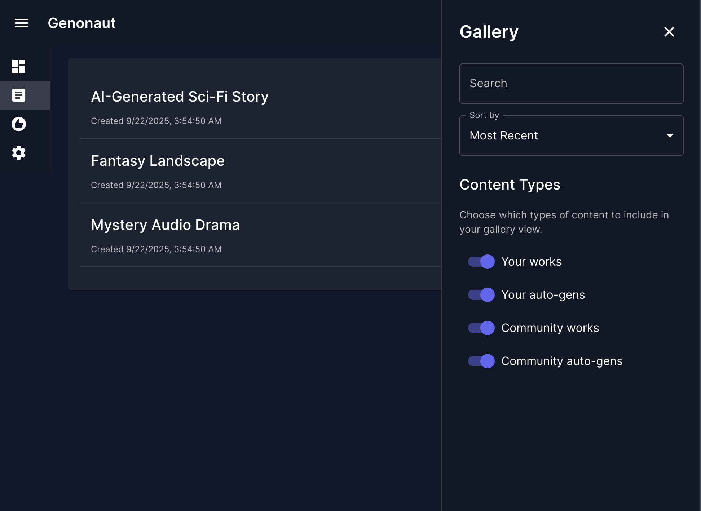

<p align="center">
  
</p>

Supercharge your Gen-AI art process. Generate huge numbers of images based on your preferences, artistic 
directions you wish to explore, and novel routes you didn't even think of. Find models and prompts that work amazingly 
when combined, and find and filter those which do not.

Core features
- **Generations**: Generate art using ComfyUI integration.
- **Models**: Easily find and download AI models for image generation.
- **Browse & Catalogue**: Browse, search, filter, rate, and tag.
- **Recommenders**: Automatically generate works based on your preferences and use cases. Explore novel combinations / directions.
- **Community**: Browse and auto-generate based on popular community trends, and other users like you.
- **Content Moderation**: Automatic content flagging system with risk assessment and admin management tools.

Platforms
- **Cloud**
- **Windows, MacOS, & Linux**: Local and browser-based

---

<p align="center">
  Early alpha development UI.
</p>

<!-- Row 1: one image centered -->
<p align="center">
  <a href="docs/screenshots/dash.png">
    
  </a>
</p>

<!-- Row 2: two images side by side -->
<table>
  <tr>
    <td align="center" width="50%">
      <a href="docs/screenshots/gens.png">
        
      </a>
    </td>
    <td align="center" width="50%">
      <a href="docs/screenshots/settings.png">
        
      </a>
    </td>
  </tr>
</table>

<p align="center">
  Join the <a href="https://forms.gle/2e2uC3owXLNNS4tTA">waiting list</a> to be notified for early access.
</p>
 

## Set up
### Installation
Prerequisites
  - Python 3.10+

Installation steps:
1. Create virtual environment: `virtualenv env/python_venv`, and activate it.
2. `pip install -r requirements.txt`
3. Create Postgres DB
  - Create your `.env` file (see "Environment variables" below)
  - Run: `make init` or `python -m genonaut.db.init`

### Environment variables
Configure database and API settings via environment variables:

**Setup:**
1. Copy the example environment file: `cp env/env.example .env`
2. Edit `.env` with your actual database credentials.

**Required Variables:**
- `DB_PASSWORD_ADMIN` - Admin user password (full database privileges)
- `DB_PASSWORD_RW` - Read/write user password (data operations only)  
- `DB_PASSWORD_RO` - Read-only user password (select operations only)

**Key Optional Variables:**
- `DATABASE_URL` - Complete PostgreSQL connection URL (recommended for production)
- `API_SECRET_KEY` - Secret key for JWT tokens and cryptographic operations
- `APP_ENV` - Which database to use by default (`dev`/`demo`/`test`)

For complete environment variable documentation, configuration behavior, and troubleshooting, see [Database Documentation](docs/db.md).

### Database Setup

After configuring environment variables, initialize the database:

```bash
make init          # main database
make init-demo     # demo database
make init-test     # test database (truncates & re-seeds with demo fixtures)
```

This creates the necessary database tables and schema. For detailed database documentation including schema details, JSONB usage, and troubleshooting, see [Database Documentation](docs/db.md).

## Running

### API Server

Genonaut provides a complete REST API with 77 endpoints across 6 categories (Users, Content, Interactions, Recommendations, Generation Jobs, System).

```bash
# Start API server
make api-dev                # Development database
make api-demo               # Demo database  
make api-test               # Test database
```

**Quick Access:**
- Interactive docs: `http://localhost:8001/docs`
- Health check: `http://localhost:8001/api/v1/health`

For complete API documentation, endpoint details, configuration options, and troubleshooting, see [API Documentation](docs/api.md).

### Frontend

The React frontend lives in `frontend/` and mirrors the API feature set with dashboard, content, recommendation, settings, and auth placeholder pages.

- Install deps: `cd frontend && npm install`
- Dev server: `npm run dev`
- Tests & linting: `npm run test` (all tests), `npm run test-unit` (unit only), `npm run lint`
- Make helpers: `make frontend-dev`, `make frontend-test`, `make frontend-build`

See [Frontend Overview](docs/frontend/overview.md) for architecture, commands, and testing notes.

## Celery + Redis for Async Tasks

Genonaut uses Celery with Redis for asynchronous task processing, primarily for image generation jobs via ComfyUI integration.

### Prerequisites

1. **Redis Server**: Install and start Redis
   ```bash
   # macOS
   brew install redis
   brew services start redis

   # Ubuntu/Debian
   sudo apt-get install redis-server
   sudo systemctl start redis

   # Docker
   docker run -d -p 6379:6379 redis:latest
   ```

2. **Environment Variables**: Already configured in `.env` (see env/.env for Redis URLs and namespaces)

### Running Workers

Start a Celery worker to process async tasks:

```bash
# Development environment
make celery-dev              # Start Celery worker for dev

# Demo/Test environments
make celery-demo             # Start Celery worker for demo
make celery-test             # Start Celery worker for test
```

**Typical Workflow:**
```bash
# Terminal 1: Start API server
make api-dev

# Terminal 2: Start Celery worker
make celery-dev

# Terminal 3: (Optional) Start Flower monitoring dashboard
make flower-dev              # Access at http://localhost:5555
```

### Flower Monitoring Dashboard

Monitor your Celery workers and tasks in real-time:

```bash
make flower-dev              # Development (http://localhost:5555)
make flower-demo             # Demo
make flower-test             # Test
```

Flower provides:
- Real-time task monitoring
- Worker status and statistics
- Task history and results
- Task retry and revoke capabilities

### Redis Management

Useful Redis commands for development:

```bash
# View keys in Redis
make redis-keys-dev          # List all keys in dev DB
make redis-info-dev          # Show Redis DB size

# Clear Redis data (use with caution!)
make redis-flush-dev         # Flush dev Redis DB (DB 4)
make redis-flush-demo        # Flush demo Redis DB (DB 2)
make redis-flush-test        # Flush test Redis DB (DB 3)
```

### How It Works

1. **Job Creation**: When you create a generation job via API, it's queued in Celery
2. **Worker Processing**: Celery worker picks up the job and processes it asynchronously
3. **Status Updates**: Job status is updated in the database (pending → running → completed/failed)
4. **Task ID**: Each job has a `celery_task_id` for tracking and cancellation

**Example API Usage:**
```bash
# Create a generation job (returns immediately with job_id)
curl -X POST http://localhost:8001/api/v1/generation-jobs/ \
  -H "Content-Type: application/json" \
  -d '{
    "user_id": "your-user-id",
    "job_type": "image",
    "prompt": "a beautiful sunset over mountains",
    "width": 832,
    "height": 1216
  }'

# Check job status
curl http://localhost:8001/api/v1/generation-jobs/{job_id}

# Cancel a job
curl -X POST http://localhost:8001/api/v1/generation-jobs/{job_id}/cancel
```

### Troubleshooting

**Worker won't start:**
- Ensure Redis is running: `redis-cli ping` (should return "PONG")
- Check environment variables in `.env`
- Verify Python virtual environment is activated

**Jobs stuck in pending:**
- Ensure Celery worker is running
- Check worker logs for errors
- Verify Redis connection: `redis-cli -n 4 KEYS '*'` (for dev)

**Clear stuck jobs:**
```bash
make redis-flush-dev         # Clear all Redis data for dev
```

## WebSocket Real-Time Updates

Genonaut provides WebSocket endpoints for real-time job status updates. Clients can connect to monitor generation job progress and receive instant notifications when jobs complete.

### WebSocket Endpoints

**Monitor a single job:**
```
ws://localhost:8001/ws/jobs/{job_id}
```

**Monitor multiple jobs:**
```
ws://localhost:8001/ws/jobs?job_ids=123,456,789
```

### Message Format

The WebSocket server sends JSON messages for job status updates:

```json
{
  "job_id": 123,
  "status": "started|processing|completed|failed",
  "timestamp": "2025-10-03T12:00:00Z"
}
```

**Status-specific fields:**

- `processing`: May include `"progress": 50` (percentage)
- `completed`: Includes `"content_id": 456` and `"output_paths": [...]`
- `failed`: Includes `"error": "error message"`

### Example Client Usage

**JavaScript/Browser:**
```javascript
const ws = new WebSocket('ws://localhost:8001/ws/jobs/123');

ws.onopen = () => {
  console.log('Connected to job 123');
};

ws.onmessage = (event) => {
  const update = JSON.parse(event.data);

  switch (update.status) {
    case 'started':
      console.log('Job started!');
      break;
    case 'processing':
      console.log(`Processing... ${update.progress || 0}%`);
      break;
    case 'completed':
      console.log('Completed! Content ID:', update.content_id);
      console.log('Image paths:', update.output_paths);
      break;
    case 'failed':
      console.error('Failed:', update.error);
      break;
  }
};

ws.onerror = (error) => {
  console.error('WebSocket error:', error);
};

ws.onclose = () => {
  console.log('Connection closed');
};

// Keep connection alive with ping/pong
setInterval(() => {
  if (ws.readyState === WebSocket.OPEN) {
    ws.send(JSON.stringify({ type: 'ping' }));
  }
}, 30000);
```

**Python:**
```python
import asyncio
import websockets
import json

async def monitor_job(job_id):
    uri = f"ws://localhost:8001/ws/jobs/{job_id}"

    async with websockets.connect(uri) as websocket:
        async for message in websocket:
            data = json.loads(message)
            print(f"Job {data['job_id']}: {data['status']}")

            if data['status'] == 'completed':
                print(f"Content ID: {data['content_id']}")
                break
            elif data['status'] == 'failed':
                print(f"Error: {data['error']}")
                break

# Run the monitor
asyncio.run(monitor_job(123))
```

### Connection Health

The WebSocket server supports ping/pong messages to keep connections alive:

```javascript
// Send ping
ws.send(JSON.stringify({ type: 'ping' }));

// Server responds with pong
// { "type": "pong" }
```

### Requirements

- Redis must be running for pub/sub messaging
- Celery worker must be running to publish job updates
- WebSocket connections are stateful - reconnect if disconnected

## Testing

Genonaut uses a three-tier testing approach: unit tests (no dependencies), database tests (requires DB), and API integration tests (requires web server).

### Essential Commands
```bash
# Quick testing during development
make test-unit              # Unit tests only (< 10 seconds)
make test-db                # Database tests (30-60 seconds)
make test-api               # API integration tests (2-5 minutes)

# Comprehensive testing
make test-all               # Run all test suites

# Test database setup
make init-test              # Initialize test database
make api-test               # Start API server for testing
```

For detailed testing documentation, setup requirements, troubleshooting, and best practices, see [Testing Documentation](docs/testing.md).

## Content Flagging

Genonaut includes an automatic content flagging system that detects potentially problematic content based on configurable word lists.

### Quick Setup

1. Create your flag words configuration:
   ```bash
   cp docs/flag-words.txt.example flag-words.txt
   ```

2. Edit `flag-words.txt` to add words that should trigger flagging

3. Content is automatically flagged during creation - no additional setup needed!

### Features

- **Automatic Detection**: Content is scanned when created
- **Risk Scoring**: 0-100 risk score with configurable thresholds
- **Admin API**: Full REST API for managing flagged content
- **Statistics**: Real-time metrics about flagged content
- **Bulk Operations**: Review and delete multiple items at once

### Documentation

- **Quick Start**: [5-Minute Setup Guide](docs/flagging-quickstart.md) - Get started fast!
- **Full Guide**: [Content Flagging Documentation](docs/flagging.md) - Complete API reference and examples
- **Testing**: [Testing Guide](docs/flagging-testing.md) - Test suites and manual testing checklist
- **API Reference**: See `/api/v1/admin/flagged-content` endpoints in API docs (http://localhost:8001/docs)
- **Implementation Spec**: [Technical Details](notes/flagging.md) - Phase-by-phase implementation notes

## Developer docs
Running tests:
`make test` or `pytest test/ -v` (`-v` optional, for verbosity)

See more: [full dev docs](docs/developer.md)

---

<p align="center">
  Join our <a href="https://forms.gle/2e2uC3owXLNNS4tTA">waiting list</a> to be notified about early access!
</p>
